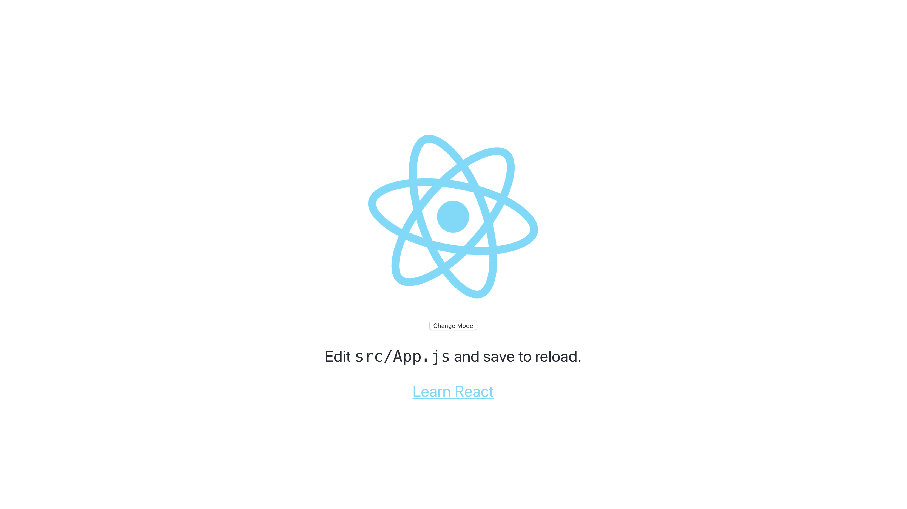
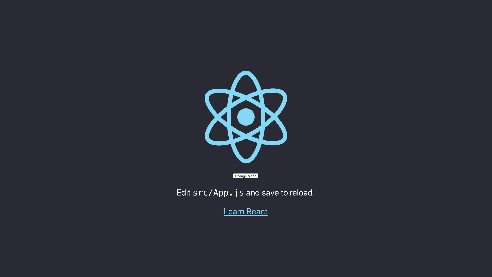

# Dark Mode App

Dark Mode App is based in the post of [@lucciddev](https://dev.to/lucciddev) [Getting started with React Context](https://dev.to/lucciddev/getting-started-with-react-context-mc7)

## Requirements

- React >= 16.13.1
- npm >= 6.13.4

## Version

1.0.0

## Installation

Download zip file and extract it [latest release](https://github.com/reysmerwvr/dark-mode-app). Or clone the repository and cd into it.

dark-mode-app uses a number of open source projects to work properly:

-[React] - React

Install the dependencies and start the server.

```sh
cd dark-mode-app
npm install
```

## Running with NPM

Run the following command to start the HTTP Server.

```sh
npm start # Run React App
```

## Demo

(Live Demo) [https://reysmerwvr.github.io/dark-mode-app]




## Meta

Reysmer Valle – [@ReysmerWVR]

## License

Dark Mode App is (c) 2020 Reysmer Valle ([@ReysmerWVR]) and may be freely distributed under the [license-url](https://github.com/reysmerwvr/dark-mode-app/tree/master/LICENSE). See the `MIT-LICENSE` file.

### Todos

- Write tests
- Add code comments

[//]: # (These are reference links used in the body of this note and get stripped out when the markdown processor does 
its job. There is no need to format nicely because it shouldn't be seen. Thanks SO - http://stackoverflow.com/questions/4823468/store-comments-in-markdown-syntax)

   [React]: <https://reactjs.org//>
   [@ReysmerWVR]: <http://twitter.com/ReysmerWVR>
